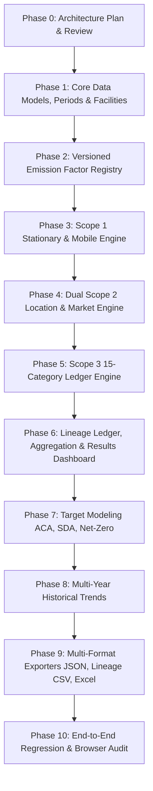

# Corporate GHG Inventory Expansion — Implementation Plan

> **Status:** Architecture Review Phase (Phase 0)  
> **Target System:** NetZeroCalc-AI Modular Dual Engine (Product Carbon Footprint + Corporate GHG Inventory)  
> **Primary References:** `NetZeroCalc_Antigravity_Implementation_Spec.xlsx`, GHG Protocol Corporate Accounting Standard, Scope 2 Guidance, Scope 3 Standard, ISO 14064-1:2018  
> **Non-Negotiable Mandate:** DO NOT rewrite existing PCF/BOM features. Expansion is strictly additive and modular.

---

## 1. Executive Summary & Architectural Vision

NetZeroCalc-AI is expanding from a specialized Product Carbon Footprint (PCF) and Bill of Materials (BOM) to Life Cycle Inventory (LCI) workbench into a dual-engine environmental accounting platform supporting both:
1. **Product Carbon Footprint (PCF) / BOM / LCI Engine:** Fast prototyping of manufacturing BOMs, semantic matching to open LCI databases (DEFRA, CEA, EU CBAM, ecoinvent BYOL), 5-indicator Pedigree DQR matrix, material substitution simulation, BRSR Core PCF export, and openLCA JSON-LD packaging.
2. **Corporate GHG Inventory Accounting Engine:** Complete corporate accounting across Reporting Periods, Facilities Registry with active-date boundary logic, Scope 1 (Stationary & Mobile Combustion with fuel/distance methods), Dual Scope 2 (Location-Based & Market-Based with certificate hierarchy), Scope 3 (Categories 1–15 across Supplier-Specific, Activity-Based, and Spend-Based methods), Versioned Emission Factor Registry with custom overrides, Granular Calculation Lineage, Target Trajectory Modeling (ACA, SDA, Net-Zero), Multi-Year Historical Trends, and Auditor-Grade Exports (JSON, Lineage CSV, Multi-Tab Excel Workbook).

```
NETZEROCALC-AI ARCHITECTURE
├── PRODUCT CARBON FOOTPRINT (PROTECTED DOMAIN)
│   ├── BOM Import (CSV / Excel / Google Sheets)
│   ├── Semantic LCI Matcher & Candidate Disambiguation
│   ├── ISO 14044 Pedigree DQR Scoring (TER, GER, TIR)
│   ├── Decarbonization What-If Simulator & Hotspots
│   └── Multi-Standard PCF Exports (BRSR, openLCA, Vector PDF)
│
├── CORPORATE GHG INVENTORY (NEW MODULAR DOMAIN)
│   ├── Organization & Workspace Profile
│   ├── Reporting Period Registry (arbitrary date bounds & FY tracking)
│   ├── Facility Registry (active-date filtering & grid mapping)
│   ├── Scope 1 Engine (Stationary + Mobile Combustion)
│   ├── Dual Scope 2 Engine (Location-Based + Market-Based hierarchy)
│   ├── Scope 3 Ledger (Categories 1–15 with 3 calculation methods)
│   ├── Versioned Emission Factor Registry (provenance, GWP, overrides)
│   ├── Calculation Lineage Engine (100% explainable audit trail)
│   └── Corporate Inventory Roll-Up & Results Dashboard
│
├── TARGETS & TRAJECTORIES (SEPARATE SCENARIO DOMAIN)
│   ├── Absolute Contraction Approach (ACA)
│   ├── Sectoral Decarbonization Approach (SDA / Intensity Convergence)
│   ├── Net-Zero Trajectory (≥90% reduction floor & residual emissions)
│   └── Multi-Year Historical Trend Analysis (requires ≥2 periods)
│
└── SHARED INFRASTRUCTURE & REPORTING
    ├── Pure Calculation & Unit Normalization Services
    ├── LocalStorage & Optional Cloud / Supabase Persistence
    ├── UI Design System & Responsive Navigation
    └── Multi-Format Exporters (JSON Schema v2, Lineage CSV, Auditor Excel)
```

---

## 2. Current Codebase Audit

### 2.1 Existing Entry Points & Navigation
- **`src/main.jsx`**: Bootstraps the React 19 application.
- **`src/App.jsx`**: Central state coordinator. Manages:
  - Active tabs (`workbench`, `simulator`, `compliance`, `ghg-calculator`, `dqr`, `cbam`, `lci-search`, `projects`).
  - Active project (`projects` array, `activeProjectId`).
  - Active period (`activePeriodYear`, `periods` array).
  - User profile and change logs.
  - Modals (Import, Google Sheets, Tutorial, AI Copilot).
- **`src/components/NavigationTabs.jsx`**: Primary tab navigation bar with a secondary "Tools & Registry" dropdown menu.
- **`src/components/Header.jsx`**: Organization branding, standard selector, geography toggle, and user profile management.

### 2.2 Existing Calculation Engines
- **PCF / BOM Total**: Calculated via `computeBomTotal(bom)` summing `item.result_tco2e || (item.qty * item.ef / 1000)`.
- **Unit Normalization**: `backend/app/units.py` supports mass (`kg`, `lb`, `g`, `t`, `oz`), energy (`kWh`, `MJ`, `kJ`), distance (`km`, `mi`), transport (`tkm`, `ton-mile`), volume (`L`, `m3`), passenger-distance (`p-km`), and spend (`INR`).
- **LCI Matching & DQR**: `backend/app/matching.py` performs bag-of-words token hashing (`local-hash-v1`), cosine similarity ranking, and pedigree heuristics with forced `HIGH` risk on placeholder factors.

### 2.3 Existing Emission Factors & Data Sources
- **`src/data/indiaGhgFactors.js`**: 60 curated India GHG factors extracted from `GHG_Calculator_RECTIFIED_v6.xlsx` with provenance tagging (`clean`, `uplifted`, `proxy`, `placeholder`).
- **`src/data/globalLciDatabase.js`**: General materials and electricity factors.
- **`src/data/cbamBenchmarks.js`**: EU CBAM benchmark values.
- **Backend Database**: `bom_lci.db` (SQLite) containing seeded `lci_processes`.

### 2.4 Existing Storage & Reporting
- **Storage**: Client-side `localStorage` (`netzerocalc_v3_projects`, `netzerocalc_active_proj_id`, `netzerocalc_active_period`, `netzerocalc_user_profile`, `netzerocalc_excel_cell_edits`).
- **Reporting**:
  - `src/services/pcfExport.js`: BRSR Core Principle 6 PCF JSON/CSV.
  - `src/services/openLcaBridge.js`: openLCA JSON-LD exchange.
  - `src/pdf/GhgDeclarationDocument.jsx`: 5-page vector PDF declaration.
  - `src/components/GhgCalculatorView.jsx`: In-browser spreadsheet viewer using FortuneSheet and LuckyExcel.

---

## 3. Detailed Review of the Specification Workbook (`NetZeroCalc_Antigravity_Implementation_Spec.xlsx`)

The workbook contains four key worksheets that directly dictate the data model and functionality:

| Worksheet | Key Requirements & Architecture Mandates |
| :--- | :--- |
| **`Inventory Map`** | Defines 19 functional mapping areas from Setup (Periods, Facilities) to Scopes 1–3, Targets (ACA, SDA, Net-Zero), Lineage, and Exports. Specifies priority (P0 for core inventory, P1 for targets/trends/auditor workbook, P2 for MACC). |
| **`Input Dictionary`** | Explicit definitions of 37 field types, validation rules, and guidance across Workspace, Facility, Scope 1 (Stationary/Mobile), Scope 2 (Location/Market), Scope 3 (15 categories across 3 methods), Targets, and Audit Lineage. |
| **`Recommended Architecture`**| Establishes an 11-tier modular stack, keeping PCF/BOM as a protected capability while layering Corporate Inventory, Target Engine, and Exporters. |
| **`Gap Summary`** | Identifies exact delta between current prototype state and production corporate GHG accounting platform. |

---

## 4. Proposed Corporate GHG Inventory Architecture

To prevent regressions and avoid polluting the existing PCF data model, the corporate GHG functionality will be implemented in a dedicated modular namespace: `src/services/ghg/` and `src/components/ghg/`.

### 4.1 Data Model Specification (`src/types/ghg.js` or `src/services/ghg/types.js`)

#### 1. Organization & Workspace
```typescript
interface Organization {
  id: string;
  name: string;
  country: string;
  consolidationApproach: 'Operational Control' | 'Financial Control' | 'Equity Share';
  gwpBasis: 'IPCC AR6' | 'IPCC AR5' | 'IPCC AR4';
  createdAt: string;
  updatedAt: string;
}
```

#### 2. Reporting Period
```typescript
interface ReportingPeriod {
  id: string;
  organizationId: string;
  label: string;             // e.g. "FY 2024-25" or "CY 2024"
  reportingYear: number;     // e.g. 2024
  startDate: string;         // ISO date "2024-04-01"
  endDate: string;           // ISO date "2025-03-31"
  isBaseYear: boolean;
  status: 'draft' | 'in_review' | 'locked' | 'assured';
  createdAt: string;
  updatedAt: string;
  // Backward-compatibility: retains PCF BOM linkage
  pcfBom?: Array<any>;
}
```

#### 3. Facility Registry
```typescript
interface Facility {
  id: string;
  organizationId: string;
  name: string;              // e.g. "Chennai Assembly Plant"
  code?: string;             // e.g. "FAC-001"
  country: string;           // "IN"
  region?: string;           // "Tamil Nadu"
  gridRegion: string;        // "India_Southern_Grid" or "CEA_National"
  activeFrom: string;        // ISO date "2020-01-01"
  activeTo?: string | null;  // null = ongoing operational control
  metadata?: Record<string, any>;
  createdAt: string;
  updatedAt: string;
}
```
*Active Filter Logic:* A facility is active in a period if:
`activeFrom <= period.endDate && (!activeTo || activeTo >= period.startDate)`

#### 4. Emission Factor Registry (Versioned)
```typescript
interface EmissionFactor {
  id: string;
  factorKey: string;         // e.g. "EF_DIESEL_STATIONARY_2024"
  name: string;              // "Diesel Fuel - Stationary Combustion"
  category: 'Fuel' | 'Electricity' | 'Freight' | 'Travel' | 'Materials' | 'Waste' | 'Spend';
  scope: 'Scope 1' | 'Scope 2' | 'Scope 3';
  activityType: 'Stationary Combustion' | 'Mobile Combustion' | 'Grid Electricity' | 'Market Electricity' | string;
  factorValue: number;       // e.g. 2.6558
  numeratorUnit: 'kgCO2e' | 'tCO2e';
  denominatorUnit: 'Liters' | 'kg' | 'scm' | 'kWh' | 'km' | 'p-km' | 'tonne-km' | 'INR' | 'USD';
  co2eUnit: string;          // "kgCO2e / Liters"
  geography: string;         // "IN", "GLO", "US"
  country?: string;
  gridRegion?: string;
  source: string;            // "India GHG Program" / "DEFRA" / "CEA CO2 Baseline"
  sourceOrganization: string;
  sourceUrl?: string;
  sourceVersion: string;     // "v2024.1"
  publicationYear: number;   // 2024
  validFrom: string;         // "2024-01-01"
  validTo?: string | null;
  gwpBasis: 'IPCC AR6' | 'IPCC AR5' | 'IPCC AR4';
  methodology: string;       // "Tier 1 IPCC default with EPA CH4/N2O uplift"
  dataQualityTier: 'Tier 1' | 'Tier 2' | 'Tier 3';
  uncertaintyPercentage?: number;
  notes?: string;
  isDefault: boolean;
  isCustom: boolean;
  createdAt: string;
  updatedAt: string;
}

interface EmissionFactorOverride {
  id: string;
  originalFactorId: string;
  replacementFactorValue: number;
  reason: string;
  evidenceReference: string;
  approvedBy: string;
  timestamp: string;
}
```

#### 5. Corporate Activity Ledger & Calculation Lineage
Every activity entry (Scope 1, 2, or 3) stores raw inputs and generates a frozen, fully auditable calculation lineage record:
```typescript
interface CalculationLineageRecord {
  recordId: string;
  activityId: string;
  periodId: string;
  facilityId?: string | null;
  facilityName?: string | null;
  scope: 'Scope 1' | 'Scope 2' | 'Scope 3';
  category: string;
  activityType: string;
  calculationMethod: 'Supplier-specific' | 'Activity-based' | 'Spend-based' | 'Location-based' | 'Market-based' | 'Fuel-based' | 'Distance-based';
  
  // Raw inputs
  rawQuantity: number;
  rawUnit: string;
  
  // Normalization
  normalizedQuantity: number;
  normalizedUnit: string;
  unitConversionFactor: number;
  
  // Factor details
  emissionFactorId: string;
  emissionFactorValue: number;
  emissionFactorUnit: string;
  factorSource: string;
  factorVersion: string;
  factorYear: number;
  geography: string;
  gwpBasis: string;
  dataQualityTier: string;
  
  // Computation
  formula: string;           // e.g. "(5,000 Liters × 2.6558 kgCO2e/Liter) / 1000 = 13.2790 tCO2e"
  resultTco2e: number;       // 13.2790
  resultKgco2e: number;      // 13279.0
  
  // Overrides & Metadata
  isOverridden: boolean;
  overrideReason?: string;
  notes?: string;
  calculatedAt: string;
}
```

---

## 5. Architectural Alignment & Conflict Resolution

### 5.1 Reconciliation with Current Architecture
1. **BOM vs. Corporate Ledger**:
   - The current application treats every row in `currentBOM` as a BOM component.
   - For Corporate GHG Inventory, we create a dedicated `corporateInventory` object within each project state, containing:
     - `facilities`: array of facilities.
     - `scope1Activities`: stationary and mobile combustion items.
     - `scope2Activities`: electricity consumption with dual reporting (location & market).
     - `scope3Activities`: 15 category ledger.
     - `factorOverrides`: registry of site/user overrides.
     - `snapshots`: calculated results and lineage logs.
   - **PCF Protection**: The existing `activePeriod.bom` remains 100% intact for the BOM Workbench, What-If Simulator, openLCA bridge, and BRSR PCF report.
2. **Dual Scope 2 Reporting**:
   - The system will explicitly calculate and report **both** Scope 2 Location-Based total and Scope 2 Market-Based total.
   - Any corporate headline figure will clearly state which Scope 2 method is being used (e.g. "Gross Emissions (Location-Based Scope 2): X tCO2e | Gross Emissions (Market-Based Scope 2): Y tCO2e").
3. **Scope 3 Category Ledger**:
   - All 15 GHG Protocol categories will be distinctly modeled with their method hierarchy: Supplier-specific > Activity-based > Spend-based.

---

## 6. Phase-by-Phase Implementation Roadmap

The implementation is structured into 10 controlled, sequential phases:



### Phase 0: Architectural Analysis & Planning (CURRENT)
- Inspect complete repository and dependencies.
- Read and parse all 4 worksheets in `NetZeroCalc_Antigravity_Implementation_Spec.xlsx`.
- Produce this comprehensive architecture and implementation plan.
- **STOP and wait for user approval.**

### Phase 1: Core Data Models, Reporting Periods & Facility Registry
- **Objectives:**
  - Create TypeScript / JS data models for `Organization`, `ReportingPeriod`, and `Facility`.
  - Implement active-facility date overlap logic.
  - Implement non-destructive migration for existing `localStorage` project data.
  - Build UI for managing Reporting Periods (add, edit, set base year, status) and Facilities (add, edit, active-date range, grid region).
- **Files to Add:**
  - `src/services/ghg/types.js` (core domain definitions)
  - `src/services/ghg/facilityService.js` (facility operations and active-date filters)
  - `src/services/ghg/periodService.js` (period operations and date validation)
  - `src/components/ghg/FacilityRegistryModal.jsx` or subview
  - `src/components/ghg/PeriodManagementModal.jsx` or subview
  - Unit tests for facility active-date filtering and period validation.

### Phase 2: Versioned Emission Factor Registry & Overrides
- **Objectives:**
  - Create central, versioned emission factor library module.
  - Seed baseline factors from `indiaGhgFactors.js` and official datasets (DEFRA 2024, CEA v20, IPCC AR6).
  - Implement factor override system with mandatory reason, evidence citation, and audit timestamp.
  - Ensure historic calculations retain their exact factor version.
- **Files to Add:**
  - `src/services/ghg/factorRegistry.js`
  - `src/components/ghg/EmissionFactorRegistryView.jsx`
  - Unit tests for factor versioning, lookups, and override persistence.

### Phase 3: Scope 1 Calculation Engine (Stationary & Mobile)
- **Objectives:**
  - Stationary combustion engine: activity quantity → unit normalization → EF lookup → lineage generation → result.
  - Mobile combustion engine:
    - Fuel-based method (fuel qty × fuel EF).
    - Distance-based method (distance × vehicle class EF).
  - Data quality tier assignment (Tier 1 default, Tier 2 country-specific, Tier 3 primary fuel lab test).
- **Files to Add:**
  - `src/services/ghg/scope1Engine.js`
  - `src/components/ghg/Scope1EntryView.jsx`
  - Unit tests covering zero values, negative invalid inputs, unit conversions, and factor overrides.

### Phase 4: Scope 2 Dual Accounting Engine (Location-Based & Market-Based)
- **Objectives:**
  - Location-Based: Electricity consumption (kWh) × grid-average emission factor for facility's grid region.
  - Market-Based: Contractual instrument hierarchy (Energy Attribute Certificates / RECs / PPAs → Supplier-specific rate → Residual mix → Grid default).
  - Explicit labeling: zero-rated renewable EACs must cite certificate ID and tracking standard; prevent silent assumption of zero lifecycle emissions.
  - Dual output: parallel calculation of LB and MB totals.
- **Files to Add:**
  - `src/services/ghg/scope2Engine.js`
  - `src/components/ghg/Scope2EntryView.jsx`
  - Unit tests for dual reporting and certificate override hierarchy.

### Phase 5: Scope 3 15-Category Ledger Engine
- **Objectives:**
  - Support all 15 GHG Protocol categories (Purchased Goods, Capital Goods, Fuel/Energy, Upstream Transport, Waste, Business Travel, Commuting, Upstream Leased, Downstream Transport, Processing, Use, End-of-Life, Downstream Leased, Franchises, Investments).
  - Support three calculation method families:
    - Supplier-Specific: primary supplier EPD or verified kgCO2e.
    - Activity-Based: physical quantity (mass, distance, volume) × secondary factor.
    - Spend-Based: monetary expenditure × EEIO / spend factor.
  - Connect with Pedigree DQR framework. Default to organization/period level with optional facility assignment.
- **Files to Add:**
  - `src/services/ghg/scope3Engine.js`
  - `src/components/ghg/Scope3LedgerView.jsx`
  - Unit tests for all 15 categories across the three method families.

### Phase 6: Calculation Lineage, Aggregation & Results Dashboard
- **Objectives:**
  - Full auditability: every calculated number in Scopes 1, 2, and 3 generates a `CalculationLineageRecord`.
  - Aggregation engine: roll up by Organization, Period, Facility, Scope, and Scope 3 Category.
  - Corporate Results Dashboard displaying:
    - Scope 1, Scope 2 LB, Scope 2 MB, Scope 3.
    - Separate and clearly labeled headline totals for LB vs MB.
    - Facility roll-up table.
    - Scope 3 category breakdown bar chart.
    - Calculation lineage drawer / inspector ("Where did this number come from?").
- **Files to Add:**
  - `src/services/ghg/lineageService.js`
  - `src/services/ghg/aggregationService.js`
  - `src/components/ghg/CorporateResultsDashboard.jsx`
  - `src/components/ghg/CalculationLineageTable.jsx`

### Phase 7: Target Modeling Engine (ACA, SDA, Net-Zero)
- **Objectives:**
  - Target modeling kept strictly separate from factual inventory data (scenarios never overwrite historical snapshots).
  - Absolute Contraction Approach (ACA): base year, target year, annual reduction rate trajectory.
  - Sectoral Decarbonization Approach (SDA): base intensity, sector benchmark, convergence year, target output.
  - Long-Term Net-Zero Trajectory: base emissions, target year (≤2050), configurable reduction floor (default 90%), residual emissions requiring neutralization/permanent removals.
- **Files to Add:**
  - `src/services/ghg/targetEngine.js`
  - `src/components/ghg/TargetsView.jsx`
  - Unit tests for ACA, SDA convergence, and Net-Zero trajectories.

### Phase 8: Multi-Year Historical Trends
- **Objectives:**
  - Frozen snapshot storage for closed reporting periods.
  - Time-series charts for Scope 1, Scope 2 LB, Scope 2 MB, Scope 3, and total emissions.
  - Facility-level and Scope 3 category multi-year trend comparisons.
  - Validation: requires at least two reporting periods before displaying trend curves.
- **Files to Add:**
  - `src/services/ghg/trendService.js`
  - `src/components/ghg/CorporateTrendsView.jsx`

### Phase 9: Multi-Format Exporters (JSON, Lineage CSV, Auditor Excel)
- **Objectives:**
  - Corporate Inventory JSON Schema (v2.0.0): complete export of org, periods, facilities, activities, factor registry, lineage, and results.
  - Calculation Lineage CSV: flat tabular export with one row per calculated item and all lineage columns.
  - Auditor-Oriented Multi-Tab Excel Workbook:
    - Cover & Scope Summary
    - Inventory Summary
    - Scope 1 Detail
    - Scope 2 Detail (Dual LB/MB)
    - Scope 3 Detail (Cat 1–15)
    - Facility Summary
    - Emission Factor Register & Overrides
    - Calculation Lineage Ledger
    - Methodology & GWP Assumptions
    - Targets & Net-Zero Summary
- **Files to Add:**
  - `src/services/ghg/corporateExportService.js`
  - `src/services/ghg/auditorWorkbookService.js` (using SheetJS / XLSX)
  - Unit tests reconciling export values with on-screen computations.

### Phase 10: Regression Verification, Documentation & Production Build
- **Objectives:**
  - Run full test suite (automated unit tests + regression tests).
  - Complete manual click-through verification of existing PCF/BOM features:
    - BOM upload / manual entry
    - LCI matching & override
    - DQR scoring
    - What-If simulator
    - Vector PDF generation
    - openLCA and BRSR export
  - Create required governance and methodology documentation:
    - `docs/GHG_INVENTORY_ARCHITECTURE.md`
    - `docs/GHG_CALCULATION_METHODOLOGY.md`
    - `docs/EMISSION_FACTOR_GOVERNANCE.md`
    - `docs/GHG_TEST_CASES.md`
    - `docs/GHG_DATA_MODEL.md`
  - Verify zero console errors, clean production Vite build.

---

## 7. Migration & Backward Compatibility Strategy

1. **Storage Schema Versioning**:
   - Current key: `netzerocalc_v3_projects`.
   - New key: `netzerocalc_v4_projects`.
   - On load, if `netzerocalc_v4_projects` does not exist, read `netzerocalc_v3_projects`, normalize each project by attaching default corporate inventory structures (`facilities: []`, `corporateInventory: { scope1: [], scope2: [], scope3: [] }`, `factorOverrides: []`), and persist to `netzerocalc_v4_projects` without altering the original key.
2. **Period Schema Continuity**:
   - Existing periods have `{ year: 2024, isBaseYear: false, label: 'FY2024', bom: [...] }`.
   - In v4, each period will gain `id`, `organizationId`, `startDate: '2024-01-01'`, `endDate: '2024-12-31'`, `reportingYear: 2024`, `status: 'draft'`, and keep `bom: [...]`.
   - Existing components accessing `period.bom` will continue to function without changes.

---

## 8. Regression Risks & Mitigation Matrix

| Risk | Impact | Mitigation Strategy |
| :--- | :--- | :--- |
| **Breaking Existing PCF BOM** | Critical | BOM items remain completely isolated inside `period.bom`. Corporate inventory uses separate `corporateInventory` collections. |
| **Scope 2 Ambiguity (LB vs MB)** | High | Forbid single blended Scope 2 total. Always display LB and MB side-by-side. |
| **Unit Conversion Failures** | High | All conversions go through validated `convertUnit()` service with strict dimension checking; cross-dimension conversion throws clean validation error. |
| **Recalculation Drift on Historical Years** | High | Store frozen calculation snapshots with lineage and factor versions when a period is locked/closed. |
| **Floating-Point Precision Errors** | Medium | Compute with standard IEEE 754 double precision without intermediate rounding; apply rounding (e.g. 4 decimals for tCO2e) strictly at the display and export boundary. |
| **Bundle Size Bloat** | Medium | Keep emission factor lookup indexed; lazy-load heavy components (FortuneSheet, Auditor Workbook, Recharts). |

---

## 9. Testing Strategy

### 9.1 Automated Unit Tests (to be added in `tests/ghg/`)
1. `unitConversions.test.js`: Mass, energy, volume, distance, transport, spend dimensions.
2. `facilityActiveFilter.test.js`: Ongoing facilities, past closed facilities, future facilities against period dates.
3. `scope1Stationary.test.js`: Normal, zero, negative input, invalid unit, custom factor override.
4. `scope1Mobile.test.js`: Fuel-based vs distance-based vehicle class calculation.
5. `scope2DualAccounting.test.js`: Location grid factor vs market EAC / supplier override.
6. `scope3Categories.test.js`: Categories 1–15 with supplier, activity, and spend methods.
7. `lineagePreservation.test.js`: Verifying that formula, factor vintage, and metadata are frozen in every lineage record.
8. `targetTrajectories.test.js`: ACA linear reduction, SDA benchmark convergence, Net-Zero 90% floor.
9. `exportsReconciliation.test.js`: JSON and CSV outputs exactly match UI calculated totals.

### 9.2 Regression Tests for PCF Workflow
1. Add manual BOM line with primary ingot -> auto-match -> verify tCO2e.
2. Override candidate chip -> verify updated tCO2e and data quality status.
3. Adjust DQR Pedigree scores -> verify recalculated overall DQR.
4. Run What-If Simulator -> verify delta percentage.
5. Generate PDF declaration and BRSR export -> verify file creation without exceptions.

---

## 10. Required User Review & Sign-Off

> [!IMPORTANT]
> **Phase 0 Sign-Off Required:**
> In accordance with Section 3 and Section 29 of the master engineering specification, implementation changes will NOT begin until this architecture plan has been reviewed and approved.
>
> Please confirm approval to begin **Phase 1: Core Data Models, Reporting Periods & Facility Registry**.
